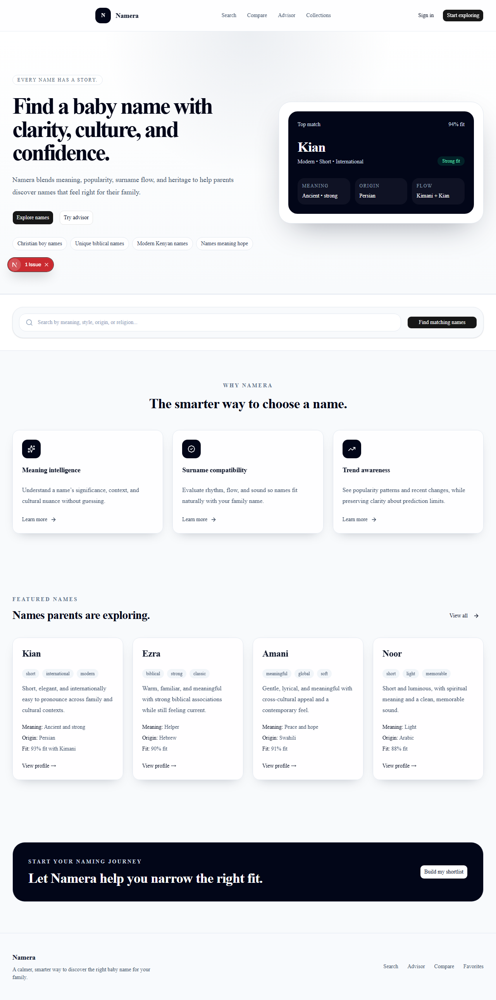
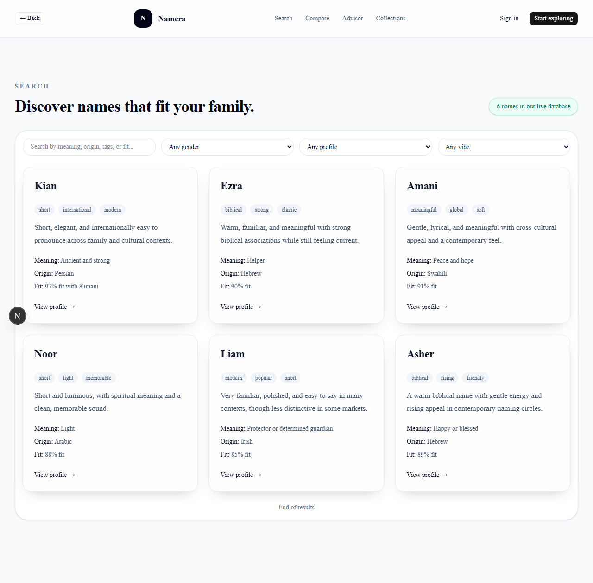
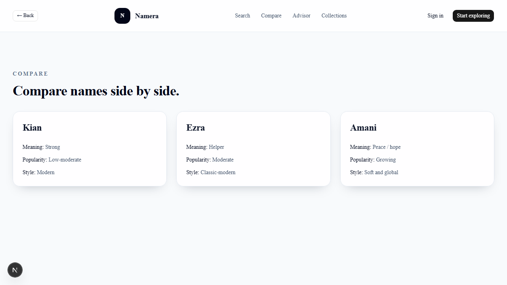
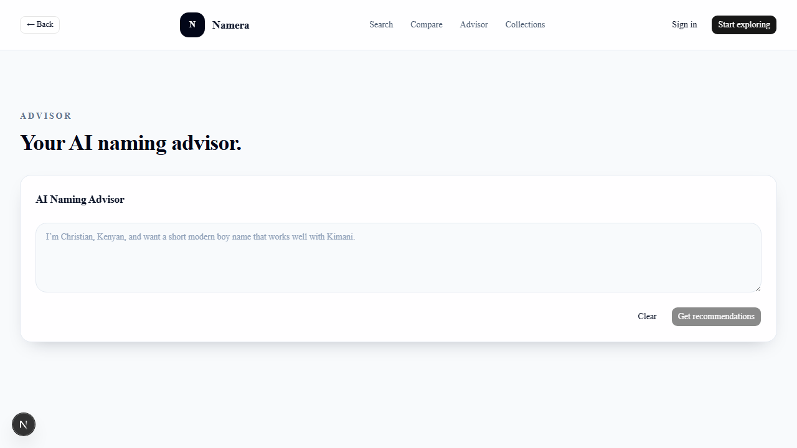
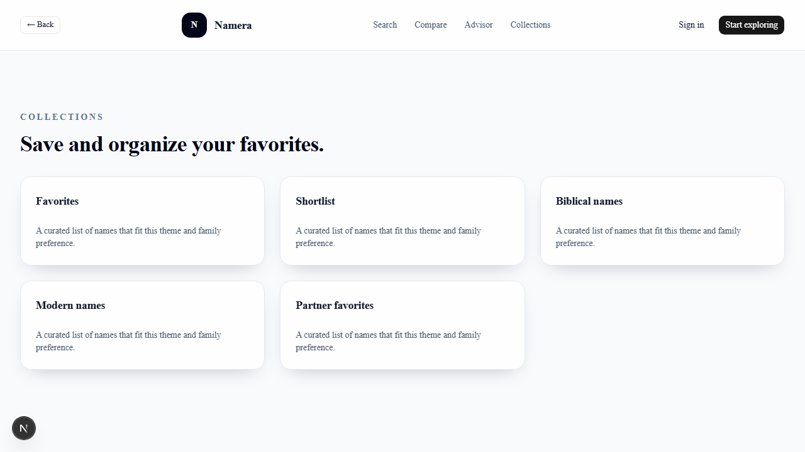
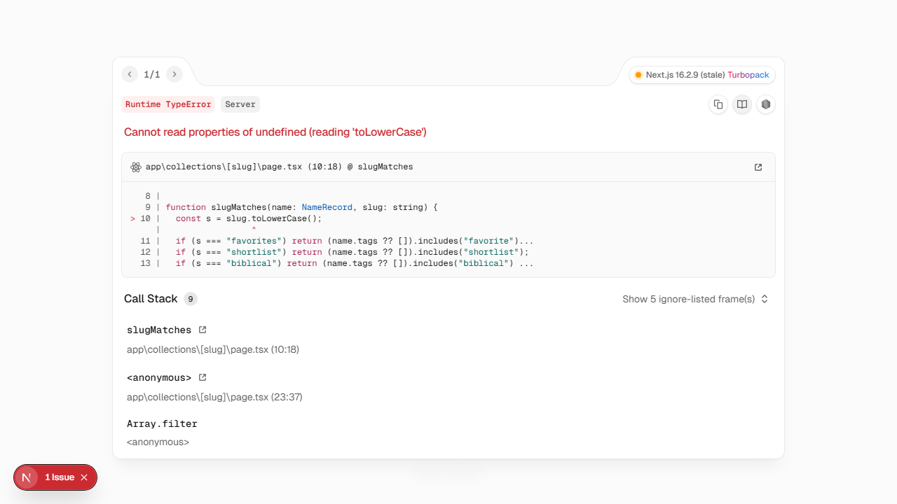
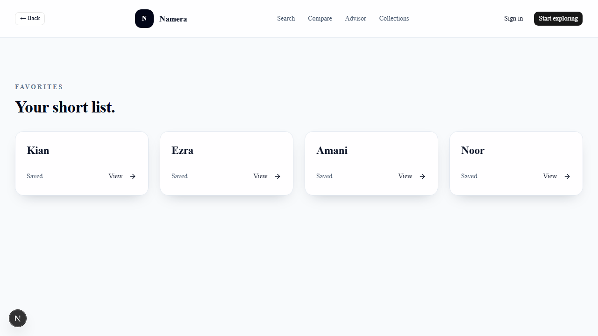
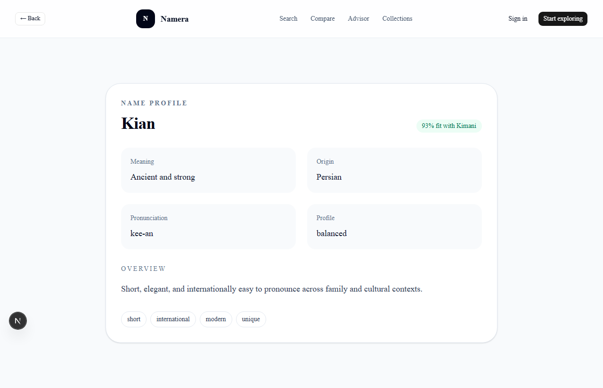

# Namera

Namera is a modern baby-name discovery platform designed to help families choose a name with more clarity, cultural context, and confidence. The product blends a polished marketing experience with a data-backed search flow that surfaces meaning, origin, style, and fit.

## Overview

The project is organized into the main product layers and a documentation folder for the roadmap and screens:

```text
Namera/
├─ apps/
│  ├─ api/          # FastAPI backend and name data access
│  └─ web/          # Next.js frontend and product UI
├─ docs/
│  ├─ NAMERA_PROJECT_BRIEF.md
│  └─ screenshots/  # UI screenshots for demo and review
├─ .gitignore
├─ alembic.ini
├─ package.json
├─ README.md
└─ .git/
```

## Product experience

The frontend is built around a naming journey that helps parents:

- search names by meaning, style, origin, or religion
- compare names side by side
- browse curated collections and featured results
- explore surname compatibility and fit signals
- review detailed name profiles and saved favorites
- move through a simple, modern discovery flow

## Feature highlights

- Search-first experience for family-friendly name discovery
- AI-style recommendation framing for fit, popularity, and meaning
- Comparison pages for evaluating multiple name options
- Collection-based browsing for organized discovery
- Detailed name profiles with cultural and contextual information
- Favorites and shortlist workflow for ongoing decisions
- Responsive, product-ready UI built with Next.js and Tailwind

## Project brief

The product strategy and long-term direction are documented in [docs/NAMERA_PROJECT_BRIEF.md](docs/NAMERA_PROJECT_BRIEF.md). This file guides the product vision, user goals, and feature roadmap.

## App screenshots

### 1. Home page



### 2. Search page



### 3. Compare page



### 4. Advisor page



### 5. Collections page



### 6. Collection detail page



### 7. Favorites page



### 8. Name profile page



## Run locally

### Frontend

```bash
cd apps/web
npm install
npm run dev
```

Open http://localhost:3000

### Backend

```bash
cd apps/api
python -m venv .venv
source .venv/bin/activate   # or .venv\Scripts\activate on Windows
pip install -r requirements.txt
python -m uvicorn app.main:app --host 0.0.0.0 --port 8000 --reload
```

## Notes

- The project brief remains in the repository to guide product decisions and future feature development.
- Screenshots are included for quick product demos and easier review.
